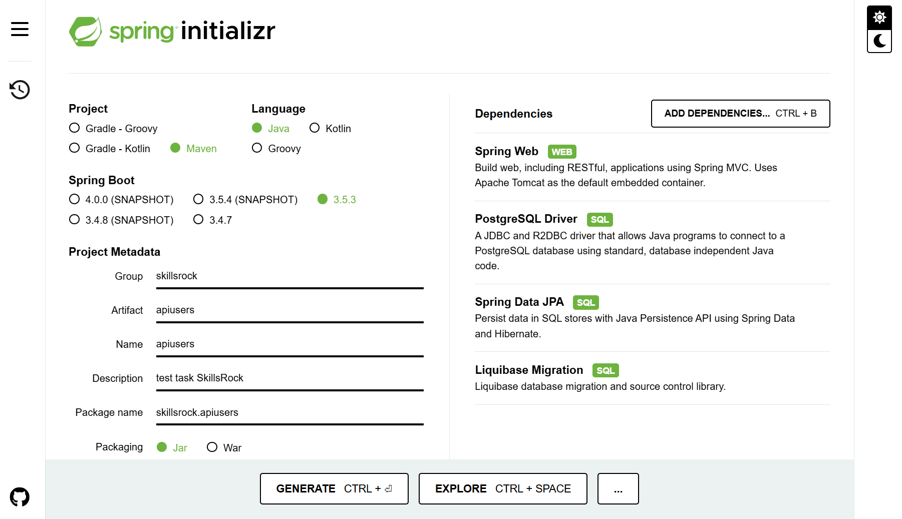

# SkillsRock IT-Аутстаффинг

## Тестовое задание на вакансию Java - Разработчик (developer)

Цель: Проверить, обладают ли кандидаты базовыми знаниями, необходимыми для обучения.

```bash
   ●​ Знание основ Java
   ●​ Понимание Spring
   ●​ Работа с Postgresql
```

## Задание

Постановка задачи: Написать REST API приложение которое будет предоставлять информацию о пользователе.

```bash
API:
  ●​ добавление нового пользователя(ФИО, тел.номер, Аватарка(url),Роль)
  ●​ получить информацию о пользователе
  ●​ обновить информацию о пользователе(изменить основные данные:
     ФИО, тел.номер, Аватарка(url), Роль)
  ●​ удалить пользователя по UUID(роль также должна быть удалена)
```

## Техническое описание задания

Стек технологий:

```bash
   ●​ Java 17
   ●​ Spring Boot 3
   ●​ PostgreSQL
```

Схема таблиц:

```bash
Users
-------------------------------------------------------------------
UUID     |    FIO     |    PhoneNumber   |   Avatar   |  Role(FK)
-------------------------------------------------------------------
         |  NOT NULL  |                  |            |
-------------------------------------------------------------------
Roles
-------------------------------------------------------------------
UUID(PK) |  RoleName  |
-------------------------------------------------------------------
         |  NOT NULL  |
-------------------------------------------------------------------
```

API-endpoints:

```bash
POST   /api/createNewUser (JSON BODY)
GET    /api/users?userID=anyUUID
PUT    /api/userDetailsUpdate (JSON BODY или Params)
DELETE /api/users?userID=anyUUID
```

Требования:

```bash
   ●​ читаемый и структурируемый код
   ●​ валидация приходящих данных
   ●​ SOLID, MVC
```

Будет плюсом:

```bash
   ●​   обработка ошибок через @ControllerAdvice
   ●​   добавление кэширования
   ●​   использование docker
   ●​   миграции с Liquibase
```

Критерии оценки

```bash
  ●​ Работоспособность API (CRUD операции).
  ●​ Качество кода и логичность структуры проекта.
  ●​ Корректная работа с PostgreSQL.
```


Время выполнения: 3 дня

## Подсказка:

Для сборки проекта spring: [https://start.spring.io/](https://start.spring.io/)



### Установка Java JDK

#### скачать установку [Java JDK](https://www.oracle.com/fr/java/technologies/downloads/) официальный сайт

### Установка PostgreSQL

#### скачать установку [PostgreSQL](https://www.enterprisedb.com/downloads/postgres-postgresql-downloads/) официальный сайт

созданиие базы данных users

```bash
CREATE DATABASE users;
```

### Запуск приложения Spring-boot REST API Web server

```bash
git clone https://github.com/SlavKoVrn/JavaApiPostgres apiusers
cd apiusers
mvnw spring-boot:run
```

### Запуск тестов приложения

```bash
cd apiusers
mvnw test
```
